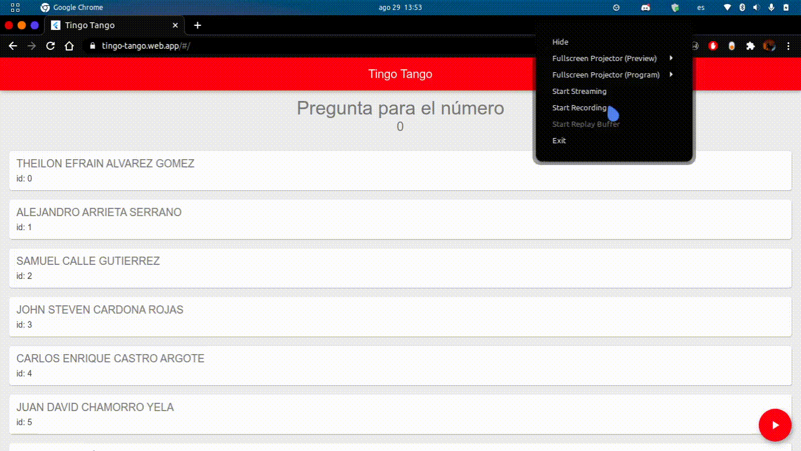
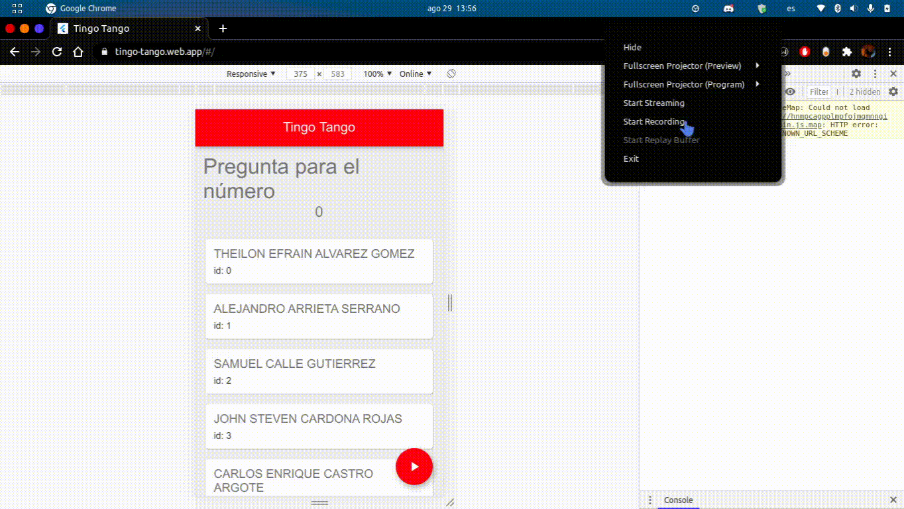
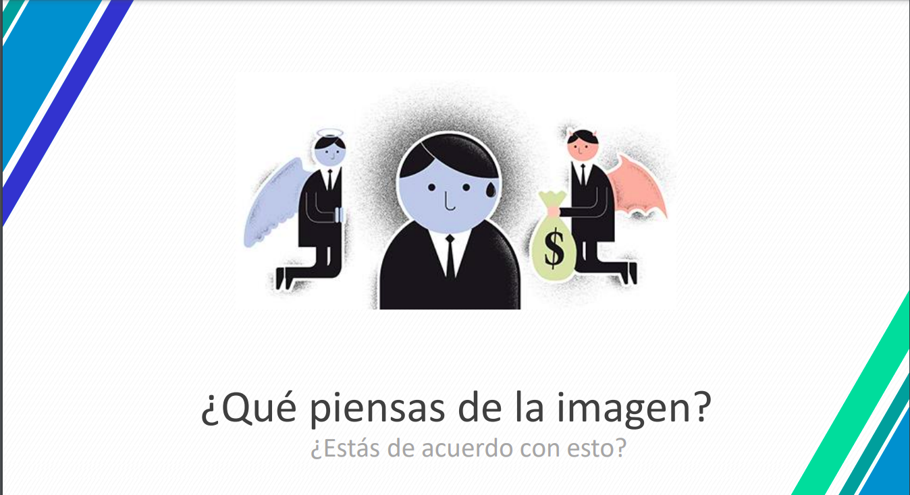

# Tingo Tango OG013100520202

This project is a simulation for the classic game from Colombia **Tingo Tango** made on Flutter, and this game given a list of people selects a random person.

This project is made for a **Procesos de gestión humana**'s activity, **Procesos de gestión humana** is a college subject and is indentified at **EAFIT University** with the code **OG013100520202**.

## Captures

### The person selected has to answer a question like this:

If you want to read all the questions follow this [link](https://github.com/Youngermaster/Tingo-Tango-OG013100520202/assets/pdf/questions.pdf).

